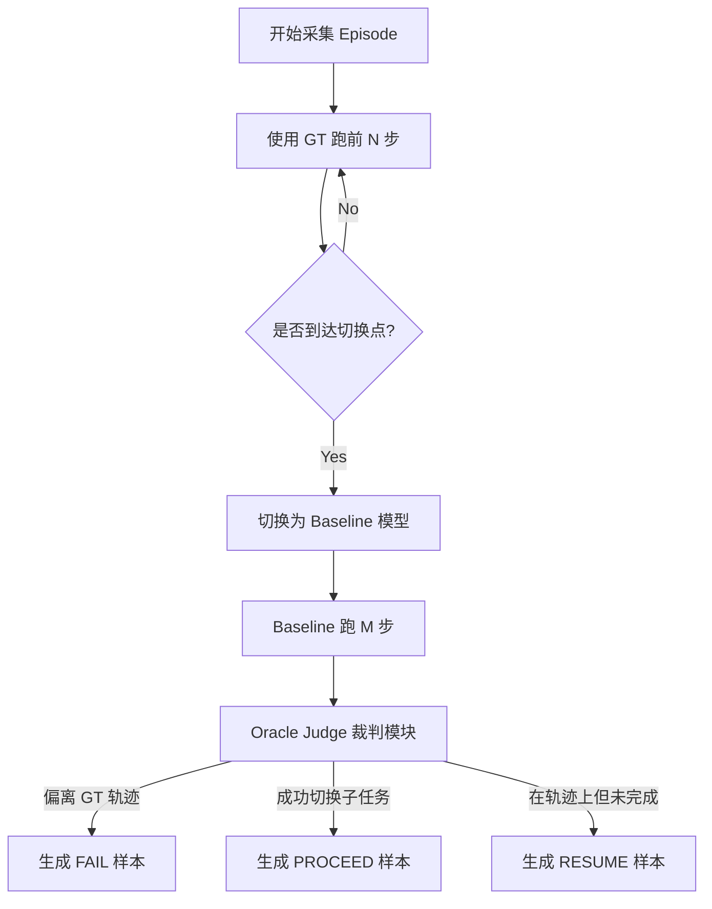

# Dataset

- Subtask decomposition
- Subtask index
- Action seqence
- map+rgb for each frame
- Cot progress( localization, subtask check, causal observation, reason, action)

```markdown
[定位]我位于短走廊的尽头，正对着通往浴室的敞开门口。RGB图像中清晰可见浴室内部（包括水槽和镜子）。俯视图显示我当前位置靠近浴室门槛，箭头指示方向正确。
[子任务判定]
[上一任务] 3 (沿走廊继续走向浴室。)
[切换检查] 真实子任务已切换至 4 (进入浴室)。这一切换是由"我已到达浴室门口阈值并与门口对齐"这一事实触发的。视觉证据确认浴室就在正前方，我已到达必须跨过门槛进入的节点。
[当前任务] 4 (进入浴室)

[因果观测]\n关键的结构性特征是正前方通往浴室的敞开门口。该子任务的目标对象是浴室入口，目前已触手可及。无需进一步的长距离直行。
[推理]虽然之前的惯性是沿走廊走，但我现在必须右转以调整朝向，与浴室门口对齐。由于门口并非直接正对我当前的前进方向，为了确保能平滑、准确地进入浴室空间，必须执行右转。
[动作]turn_right (右转)
```

# 整体架构

Actor 是 VLN 架构中的执行者，负责并行输出后续 N 个 timestep 的 action，同时为每个时刻输出一个 progress 数值，表示在整个子任务中的完成进度。Actor 的输入子任务由 Watcher 决定和调度。Actor 作为无状态的执行者，可能会出错，因此需要 Watcher 进行纠正和反思。

Watcher 是监管者和计划者，通过检测 Actor 状态来更改计划或重新执行当前子任务。判断条件结合了 Actor 的 progress 预测和实际输出的 action。当 progress 超过阈值或 action 变成 stop 时，表示 Actor 认为当前子任务基本完成，此时可以调用 Watcher 进行更详细的任务状态判断。

Watcher 采用更大的模型，结合记忆模块和 CoT 方法对当前状态进行细致判断。主要有三种输出：resume——子任务保持不变，重新调用 Actor；proceed——切换到下一个子任务，在新子任务上调用 Actor；fail——最难处理的部分，缺乏数据进行判断。较好的做法是回到上一次调用 Watcher 的时刻，重新执行 action。此时 action 需要重新采样，并且与之前的选择有所不同（这部分最好和 CycleVLA 有一定区别）。

Actor 的架构比较简单，主要难点是 progress 的预测不一定准确，但有一些方法可以提升。

需要监控 val 数据集和实际的差距，最好不加太多历史帧，通过实验优化。

后续可以考虑更进阶的隐式思维链，最终做显式和隐式的结合。

Watcher 的难点较多。第一是 memory 的设计

第二是 CoT 加 GRPO 的设计——需要设计怎样的 GRPO 奖励？还是暂时不考虑 GRPO，只输出显式的思维链？

目前的数据集：localization 用于总结当前位置信息和 subtask check reasoning。本质上这是 subtask determination 问题的变形，可以用数据采集中的一些方法进行优化和尝试。

当前数据集只考虑了是否 proceed 到下一个任务，没有考虑 failure 的情况，也没有对应的数据，需要想办法解决。

# Actor

- 基本架构：Qwen3-VL （小模型，2B）
- 输入：cur img + subgoal。可能有 subtask 第一帧的 img
- 输出：并行输出 N* a' (a' = [a,p]) 可以预测是否 finish，但是有 progress 即可
- 形式：Aux-think
- 难点： progress 的预测
- parallel decoding
- 优化点：分离 action 和 progress token。 history tokens？ anchor frame？ max subtask len？

## Q1：如何优化progress的预测准确度？

1. 分离 action 和 progress embedding，每一个 timestep 加上两个 embedding
2. history token : 麻烦，但是用 KV cache 计算量还行
3. anchor frame：当前 watcher 调用时的第一帧
4. max subtask len：限制最大的 subtask 长度，如果超过了自动触发 watcher，保证不会陷入 loop 中。

# Watcher

- 略大一点的模型（7B）
- 输入：memory，map，img，priors
- 输出：是否需要切换子任务
- 形式 ：CoT

执行计划

1. online map 的建图 + 历史轨迹 + 起点 （环境部分）
2. memory 设计
3. resume / proceed / fall back
4. 没有失败状态的数据集？如何判断失败？？
5. 是否要用 GRPO

```markdown
[State Check] Normal. Current position is at the end of the short hallway, directly facing the open bathroom door. No collision or looping detected.
[Progress Logic] Completed. Visual evidence confirms the bathroom interior (sink/mirror) is directly ahead. I have reached the threshold node required to enter the room, aligning with the "Enter Bathroom" transition condition.
[Decision] PROCEED

[State Check] Normal. Moving along the middle of the hallway; the path ahead is clear and unobstructed.
[Progress Logic] Incomplete. While the bathroom door is visible in the distance, it is still approximately 2 meters away. The agent has not yet reached the stopping threshold to trigger the next subtask.
[Decision] RESUME

[State Check] Abnormal. Visual mismatch detected. The agent is facing a blank wall instead of the open doorway required by the instruction. Additionally, the last 3 frames show high similarity, indicating a "stuck" or "looping" state.
[Progress Logic] Halted. Progress cannot be validly assessed because the agent has deviated significantly from a navigable path.
[Decision] FAIL
```

## 问题梳理

1. 如何建图？用什么库作为参考  → minyi
2. memory 如何设计？ 稀疏采样（naive） token level
3. 什么是 failure，如何构建判断 failure 的数据集？
4. GRPO 的 reward 如何设计，是否有必要？
5. implicit reasoning 是否有可能完成

## Q1：失败判断和数据采集

1. 什么是失败？ 
    1. Looping，原地打转（位置），或者一直走回头路（轨迹）
    2. Visual mismatch。目标是要去 A，结果去了 B，而且眼中没有 A
    3. deviation，本来要求直走，机器人不停转弯
2. 如何构建失败数据集？
    1. 错误路径。可以使用一个 pretrained model 在 training set 中跑，然后看他的行为与 gt 路径的偏差 可以参考 correct nav
3. 也需要加入新的 pripor 可以做出更强有力的判断



### A. 采样策略：什么时候切换模型？

为了保证数据的多样性，你需要在每个 Episode 中多次尝试“放手”让 Baseline 跑。

- **策略**：对于一条长度为 L 的 GT 轨迹，随机选择 3-5 个 **切入点 (Pivot Points)**。
    - **切入点类型 1 (Near Boundary)**：在子任务即将完成前（比如距离 Goal < 1.5米），切换给 Baseline。
        - *目的*：测试它能不能正确 **PROCEED**，还是会 Overshoot（跑过头）。
    - **切入点类型 2 (Mid-way)**：在子任务路程中间切换给 Baseline。
        - *目的*：测试它能不能稳住 **RESUME**，还是会走偏 **FAIL**。

### B. Oracle Judge：裁判逻辑（自动化打标核心）

Baseline 跑了 M 步（比如 5 步）后，如何自动给这 M 步的数据打标签？你需要利用上帝视角信息（GT Location, GT Action, GT Subtask info）。

**1. 判定 FAIL (异常)**

- **位置偏离 (Deviation)**: `Distance(Agent, GT_Path) > Threshold (e.g., 2.0m)`。
- **死循环 (Looping)**: 在 $M$ 步内位移 $< 0.5m$ 但 GT 要求移动。
- **幻觉停止 (Premature Stop)**: Agent 输出了 `Stop/Next` 动作，但 `Distance(Agent, Subgoal) > Threshold`。
- **生成 CoT 模版**:
    - `[State Check] Abnormal. Deviation detected. Distance to reference path is {dist}m.`
    - `[Decision] FAIL`

**2. 判定 PROCEED (成功切换)**

- **条件**: Agent 在 $M$ 步内成功输出了 `Stop` 或跨过了子任务边界，且 `Distance(Agent, Subgoal) < Success_Threshold (e.g., 1.0m)`。
- **生成 CoT 模版**:
    - `[State Check] Normal...`
    - `[Progress Logic] Completed. Arrived at subgoal {subgoal_name}.`
    - `[Decision] PROCEED`

**3. 判定 RESUME (继续执行)**

- **条件**: 既没偏离跑道，也没到达终点，且动作方向与 GT 趋势一致（比如 `CosineSimilarity(Agent_Vec, GT_Vec) > 0.5`）。
- **生成 CoT 模版**:
    - `[State Check] Normal...`
    - `[Progress Logic] Incomplete. Still navigating towards {subgoal_name}.`
    - `[Decision] RESUME`

---

## Q2：memory的设计

##