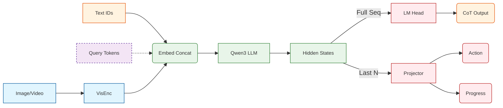

# 12/30- Actor 训练

- [x]  设计模型
- [x]  设计混合数据集



- [x]  代码重构

```markdown
thinkvln/
├── models/              # Model architectures
│   ├── thinkvln_model.py       # Base VLN model (ThinkVLNForConditionalGeneration)
│   ├── thinkvln_actor.py      # Actor with action/progress heads
│   ├── thinkvln_config.py     # Model config
│   └── actor_config.py        # Actor training config
├── engine/              # Training & inference
│   ├── sft_trainer.py         # SFT training entry point
│   └── inference.py           # Model loading and inference utilities
├── eval/                 # Evaluation scripts
│   ├── env_eval.py            # Habitat simulator evaluation
│   └── openloop_eval.py       # Open-loop evaluation
├── dataset/              # Dataset classes
│   └── dataset.py             # ThinkVLNDataset for mixed action + CoT
├── datagen/              # Data generation & preprocessing
│   ├── generation/            # CoT, subtask, trajectory generation
│   └── preprocessing/         # SFT dataset creation, frame extraction
├── tools/                # Utilities
│   ├── dataset_utils.py       # Data loading helpers
│   ├── web_refinement/        # Web-based annotation tool
│   └── dev_scripts/           # Reference scripts
├── habitat_extensions/   # Habitat simulator extensions
│   ├── maps.py                # Map utilities
│   └── measures.py            # Custom evaluation metrics
└── tests/                # Unit tests
```

- [x]  完成模型代码（qwen3 model + conditional generation 魔改）
- [x]  完成 sft trainer，wandb，deepspeed，使用 huggingface Trainer 框架
- [x]  完成 hybrid dataset（混合 action chunking + cot，使用 prompt 进行输出控制）

- [x]  dataset 测试
- [x]  模型测试
- [x]  训练流程测试( debug全程）

系统优化项

- [x]  flashattention-2
- [x]  distributed test
- [x]  lora
- [x]  freeze vision tower

- [x]  开始训练！

- [x]  progress 数值不稳定 — 忽略 ignore token
- [x]  batch 过于混合，导致没法 lm loss — 使用同质 data sampler， override get_train_dataloader
- [x]  不知道是否能正常 model save 和 resume

# 2/2-2/7

本周主要目标：

- [ ]  迭代实验 底层 actor
    
    [VLN 实验记录.csv](https://www.notion.so/2fb4e07aa02380fb9e7ed038a841fd8c?pvs=21)
    
- [ ]  设计与实现 watcher
    
    [ThinkVLN model design](https://www.notion.so/ThinkVLN-model-design-2fb4e07aa02380adb159e422883c5e62?pvs=21) 
    
- [x]  如何制造 Failure case

actor部分的ablation实验设计：

epoch全部设为 1， lora rank 32

- [x]  加不加 cot 对结果的影响（aux think） 🌟🌟🌟
- [ ]  autoregressive 和 token 对于结果的 影响，以及推理速度的影响🌟🌟🌟
- [ ]  离散化分桶 (Binning / Quantization) —— 来结合 auto regressive 🌟🌟🌟

- [x]  细节实验：progress head 的设计
- [x]  区分 progress token 和 action token
- [ ]  使用混合的 intruction 和 subgoal 的数据：数据量大
- [x]  先 freeze 整个 qwen backbone，预热 action head
- [x]  非 learnable 的 query（全 0 初始化） + L1 loss

- [ ]  **History Length (Context Window):**🌟🌟
    - 对比输入过去 `k=1` vs `k=4` vs `k=10` 帧的历史图像。
- [ ]  **History Compression (Memory Efficiency):**
    - **Baseline:** 把所有历史帧作为 Full Image Tokens 塞进去（吃显存）。
    - **Ours:** 对历史帧做 Pooling (e.g., 2x2 or Spatial Pool) 减少 token 数。
    - *目的：* 证明你的架构设计（如果有压缩机制）在不掉点的情况下大幅提升了效率。

工程：

- [ ]  eval 代码，配置 trainer arguments
- [ ]  eval 内容：action 准确率，平均 progress 误差

- [ ]  完成closed loop eval @zmy
- [ ]  在新数据上进行 scale 开始运行 @zmy
- [ ]  找 benchmark 开始测试，从 streamvln 开始

- 开发“上帝视角”可视化工具
    
    VLN 及其难 Debug，光看 Log 里的 `Action: Move, Loss: 0.5` 是没用的。你需要一个强大的可视化工具来分析 **Actor 到底是怎么死的**。
    
    - **轨迹渲染器 (Trajectory Renderer)**:
        - 利用 Habitat 的 Top-down Map，写一个脚本，能够输入一个 Episode 的 Log，画出：
            - GT 路径（绿色）。
            - Actor 实际路径（红色）。
            - **关键点标记**：在地图上标出 Watcher 介入的时刻（画一个星星），并把 Watcher 当时的 CoT 显示在旁边悬浮窗里。
    - **第一人称回放 GIF 生成**:
        - 把 RGB 帧拼成 GIF，并在每一帧下方叠加当前的 `Instruction`、`Progress 预测值` 和 `Action`。
        - **这东西将来直接可以放进论文的 Demo 视频里，早做早享受。**
    
    ### 
    
- 目录结构：
    
    ```markdown
    dataset/
    R2R/rPc6DW4iMge_r2r_008991
    scalevln/00406-n2Tt2eJdqnT_scalevln_208381 
    (base) ➜  rPc6DW4iMge_r2r_000073 ls
    000000_map.jpg  000005_rgb.jpg  000011_map.jpg  000016_rgb.jpg  000022_map.jpg
    000000_rgb.jpg  000006_map.jpg  000011_rgb.jpg  000017_map.jpg  000022_rgb.jpg
    000001_map.jpg  000006_rgb.jpg  000012_map.jpg  000017_rgb.jpg  000023_map.jpg
    000001_rgb.jpg  000007_map.jpg  000012_rgb.jpg  000018_map.jpg  000023_rgb.jpg
    000002_map.jpg  000007_rgb.jpg  000013_map.jpg  000018_rgb.jpg  000024_map.jpg
    000002_rgb.jpg  000008_map.jpg  000013_rgb.jpg  000019_map.jpg  000024_rgb.jpg
    000003_map.jpg  000008_rgb.jpg  000014_map.jpg  000019_rgb.jpg  000025_map.jpg
    000003_rgb.jpg  000009_map.jpg  000014_rgb.jpg  000020_map.jpg  000025_rgb.jpg
    000004_map.jpg  000009_rgb.jpg  000015_map.jpg  000020_rgb.jpg
    000004_rgb.jpg  000010_map.jpg  000015_rgb.jpg  000021_map.jpg
    000005_map.jpg  000010_rgb.jpg  000016_map.jpg  000021_rgb.jpg
    
    (base) ➜  data ls
    scene_datasets  versioned_data
    (base) ➜  data pwd
    /mnt/nvme/swx/hm3d/data
    ```