# close_eval `subtask` 闭环流程梳理

本文聚焦 `--ladder_mode subtask` 的闭环评测全流程，覆盖从 CLI 入口到子任务级统计聚合的完整链路。

## 1. 全流程图（Mermaid）

```mermaid
flowchart TD
    A["命令行启动<br/>python thinkvln/eval/close_eval.py ... --ladder_mode subtask"]
    B["close_eval.py facade<br/>转发到 close_eval_cli.eval()"]
    C["build_parser() + parse_args()"]
    D{"ladder_mode != legacy?"}
    E{"model_type == thinkvln_actor<br/>且 summary_full_path 非空?"}
    E1["抛出 ValueError 并终止"]
    F["load_summary_full(summary_full_path)"]
    G["init_dist_mode()<br/>得到 rank/world_size/gpu"]
    H["build_nav_model(args, device, rank, world_size)"]
    I["evaluate(nav_model, args, rank, world_size, gpu, summary_full)"]
    J["创建 VLNEvaluator(...)"]
    K["eval_subtask_closed_loop(rank, summary_full)"]
    K1["初始化 Env + stats<br/>打开 subtask_closed_loop_rank{rank}.jsonl"]
    L["遍历当前 rank 分配的 episode"]
    M{"summary_full 中有 episode_key?"}
    M1["episodes_missing_meta += 1<br/>continue"]
    N["读取并校验 actions/subtask_sequence/plan"]
    O["build_subtask_spans()<br/>_replay_gt_positions()"]
    P{"meta/轨迹有效?"}
    P1["episodes_malformed += 1<br/>continue"]
    Q["遍历每个 subtask span"]
    R["计算 gt_subtask_steps 和 step_budget"]
    S["replay_to_frame(start_frame)<br/>确定 goal_pos 与 subgoal_text"]
    T["闭环 rollout 循环<br/>predict_action_with_progress() -> env.step(action)"]
    U{"distance <= subgoal_success_distance?"}
    V["subtask 成功<br/>更新 success/steps 统计"]
    W{"episode_over 或预算耗尽?"}
    X["subtask 失败<br/>记录 fail_reason"]
    Y["写入该 subtask 的 detail jsonl"]
    Z{"还有 subtask?"}
    Z1{"还有 episode?"}
    AA["返回 local_subtask_stats"]
    AB["all_reduce_scalar_dict(local_stats)"]
    AC["rank 0: summarize_subtask_aggregation()"]
    AD["rank 0 写 ladder_summary.json<br/>subtask_closed_loop 字段"]
    AE["world_size > 1 时 destroy_process_group()<br/>流程结束"]

    A --> B --> C --> D
    D -- "是" --> E
    D -- "否" --> E1
    E -- "否" --> E1
    E -- "是" --> F --> G --> H --> I --> J --> K --> K1 --> L
    L --> M
    M -- "否" --> M1 --> Z1
    M -- "是" --> N --> O --> P
    P -- "否" --> P1 --> Z1
    P -- "是" --> Q --> R --> S --> T --> U
    U -- "是" --> V --> Y --> Z
    U -- "否" --> W
    W -- "否" --> T
    W -- "是" --> X --> Y --> Z
    Z -- "是" --> Q
    Z -- "否" --> Z1
    Z1 -- "是" --> L
    Z1 -- "否" --> AA --> AB --> AC --> AD --> AE
```



## 2. 分阶段说明（对应代码模块）

### 阶段 A：入口与参数校验（`close_eval.py` + `close_eval_cli.py`）

- `close_eval.py` 只是 facade，入口最终落到 `close_eval_cli.eval()`。
- 在 `subtask` 模式下，必须满足：
  - `--model_type thinkvln_actor`
  - `--summary_full_path` 非空且可读
- 之后读取 `summary_full.jsonl` 为 episode 元数据索引。

### 阶段 B：分布式与模型构建（`close_eval_dist.py` + `close_eval_models.py`）

- `init_dist_mode()` 初始化 rank/world_size/gpu。
- `build_nav_model(...)` 根据参数构建导航模型；`subtask` 路径要求 Actor 模型可用。

### 阶段 C：子任务闭环执行（`close_eval_runner.py`）

`evaluate(...)` 在 `ladder_mode == subtask` 时调用：

- `VLNEvaluator.eval_subtask_closed_loop(rank, summary_full)`

核心循环逻辑：

1. 遍历当前 rank 的 episode。
2. 用 `episode_key` 在 `summary_full` 查元数据。
3. 校验并读取：
   - `actions`
   - `subtask_sequence`
   - `plan`（经 `parse_plan_steps`）
4. 通过 `build_subtask_spans` 生成连续子任务片段。
5. 用 `_replay_gt_positions` 预放映 GT 轨迹位置。
6. 对每个 span 执行闭环 rollout：
   - `step_budget = max(1, ceil(gt_subtask_steps * subtask_step_budget_factor))`
   - 从 `start_frame` 回放到子任务起点
   - 设定 `goal_pos`（该 span 终点对应 GT 位置）
   - `predict_action_with_progress(...) -> env.step(action)` 迭代
   - 终止条件：
     - 距离阈值达成成功（`distance <= subgoal_success_distance`）
     - episode 结束
     - 超过 step_budget
7. 每个子任务写一条 detail 记录到：
   - `subtask_closed_loop_rank{rank}.jsonl`

### 阶段 D：聚合与落盘（`close_eval_cli.py` + `close_eval_dist.py` + `close_eval_utils.py`）

- 每个 rank 先得到 `local_subtask_stats`。
- `all_reduce_scalar_dict(...)` 求全局和。
- rank 0 调用 `summarize_subtask_aggregation(...)` 计算：
  - `subtask_success_rate`
  - `steps_to_subgoal`
  - `progress_mae`
- 最终写到 `ladder_summary.json` 的 `subtask_closed_loop` 字段。

## 3. 关键指标口径

- `subtask_success_rate`：成功子任务数 / 总子任务数。
- `steps_to_subgoal`：仅统计成功子任务的平均步数。
- `progress_mae`：模型预测进度与时间线目标进度的平均绝对误差。

## 4. 最小可复现实验命令

```bash
python thinkvln/eval/close_eval.py \
  --model_type thinkvln_actor \
  --model_path /path/to/checkpoint \
  --ladder_mode subtask \
  --summary_full_path /path/to/summary_full.jsonl \
  --habitat_config_path config/vln_r2r.yaml \
  --eval_split val_unseen \
  --output_path ./results/env_eval_subtask
```
