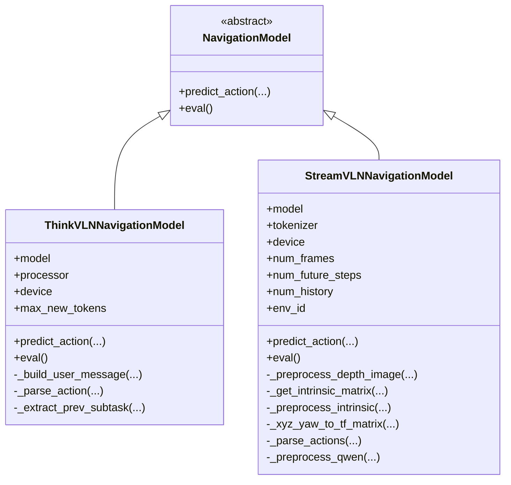
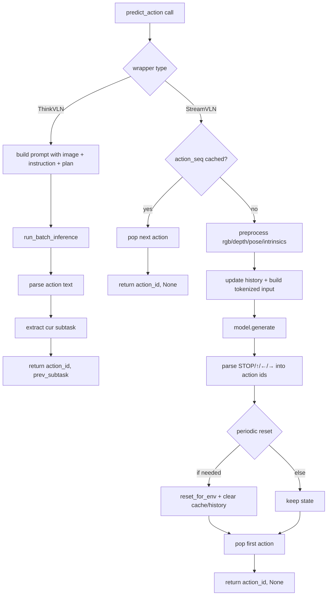

# navigation_model.py (Brief)

This module defines a unified navigation interface plus concrete wrappers for ThinkVLN and StreamVLN inference.

## Interface contract

- `NavigationModel` is an abstract base class with two required methods:
- `predict_action(observation, instruction, plan=None, prev_subtask=None, **kwargs) -> (action_id, prev_subtask)`
- `eval()` to switch model to evaluation mode.
- Action ids follow evaluator convention:
- `0=stop`, `1=forward`, `2=turn_left`, `3=turn_right`.

## Class graph

## ThinkVLNNavigationModel

- Input: PIL image observation (typically `RGB + map`) and text instruction.
- Builds a message with `<image>`, instruction, plan, and optional previous subtask.
- Runs inference via `run_batch_inference(...)`.
- Parses model text for `[action]` and maps text to action id.
- Extracts `[cur subtask]` when available and returns it for the next step.
- Safe fallback on errors or parse miss: `stop`.

## StreamVLNNavigationModel

- Input: observation dict with `rgb`, `depth`, `gps`, `compass`, `env`, and camera/depth metadata.
- Maintains streaming state:
- frame/depth/pose/intrinsic history, `time_ids`, queued `action_seq`, `past_key_values`, `output_ids`.
- Preprocesses:
- depth scaling/filtering, RGB/depth resize, intrinsics adjustment, pose transform.
- Builds Qwen-style tokenized prompt (with `<video>`, `<image>`, `<memory>` handling).
- Uses current frame + optional sampled history, then calls `model.generate(...)`.
- Parses generated symbols (`STOP`, `↑`, `←`, `→`) into action ids.
- Resets cache/history periodically (`step_count % num_frames == 0`) via `reset_for_env`.
- On any failure, defaults to `STOP`.

## Predict-action flow graph

## Why this module exists

- Keeps evaluator code model-agnostic.
- Concentrates model-specific prompt, preprocessing, and parsing logic in one place.
- Makes it easier to add new models by implementing the same `NavigationModel` API.

## Adding a new model wrapper

1. Subclass `NavigationModel`.
2. Implement `eval()` and `predict_action(...)`.
3. Return `(int_action_id, optional_prev_subtask)` every step.
4. Keep robust fallback behavior (`stop`) for bad outputs or runtime errors.
